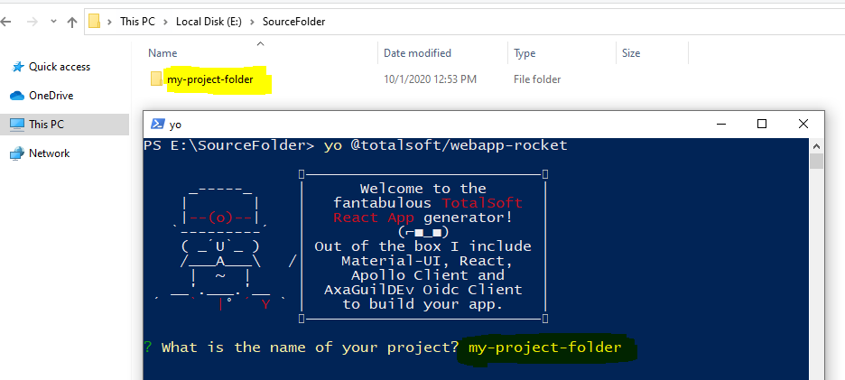
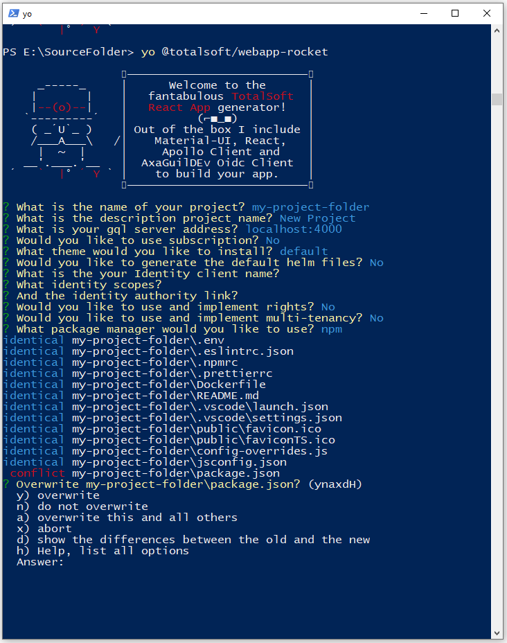

# webapp-rocket [![NPM version][npm-image]][npm-url]  
> React web application sample with GraphQL, Apollo Client and AxaGuilDEv Oidc Client integration.  
  
  
  
> We can also help you get started with your GraphQL server. Check out our [GraphQL Rocket Generator](https://github.com/osstotalsoft/generator-graphql-rocket).  
  
## Installation  
  
First, install [Yeoman](http://yeoman.io) and @totalsoft/generator-webapp-rocket using [npm](https://www.npmjs.com/) (we assume you have pre-installed [node.js](https://nodejs.org/)).  
  
```bash  
npm install -g yo  
npm install -g @totalsoft/generator-webapp-rocket  
```  
  
If you wand to use this generator to scaffold a new project navigate to section: [Generate new project](#generate-new-project)  
To upgrade an existing project that was scaffold using this **WebApp Rocket Generator**, see section: [Upgrade existing project](#upgrade-existing-project)  

## Content
1. [Generate new project](#generate-new-project)  
2. [Upgrade existing project](#upgrade-existing-project)  
3. [What is a Generator?](#what-is-a-generator)  
4. [Code formatting](#code-formatting)  
5. [Authentication](#authentication)  
6. [Authorization](#authorization)  
7. [Notifications](#notifications)  
8. [Custom hooks](#custom-hooks)  
9. [Internationalization](#internationalization)  
10. [Multi-tenancy](#multi-tenancy) 
11. [Deployment](#deployment)
12. [Getting To Know Yeoman](#getting-to-know-yeoman)

## Generate new project  
 
To scaffold your new project using our generator run:  
  
```bash  
yo @totalsoft/webapp-rocket  
```  
  
> ⚠ Make sure you have the latest version of **GraphQL WebApp Generator** installed, else you will be prompted the following message:  
  
  
  
You will be prompted to introduce the following information:  
1. The project name. This will also be the name of the new folder in which the new application will live. A valid project name, only includes lower and upper case letters, digits and '-' or '_' separators! No special characters and whitespace are allowed and do not start or end with a separator!  
2. Project description. This will be visible in the browser tab and link details.  
3. GraphQL address. By default it would be set to `localhost:4000`  
4. Use subscription. By default is set to false. This will include the WebSocket link in ApolloClient.  
5. Application theme. There is a list of available themes you can choose from.  
6. Whether to generate default helm files or not.  
7. If you choose to include default helm files you would also be prompted to specify a name for your helm chart. A valid helm chart name, only includes lower case letters, digits and '-' or '_' separators! No special characters and whitespace are allowed and do not start or end with a separator!  
8. Identity client name, configured in Identity SaaS for your new application.  
9. Identity scopes.  
10. Identity authority.  
11. Use rights. By default is set to false. This will also generate a `GET_USER_DATA` query that loads the users rights. (see the query below)  
12. Include multi-tenancy. By default is set to false.  
13. What package manager you wish to use to install the application dependencies. (npm or yarn).  
  
If you would like to start the application, simply run ``npm start`` in the newly created folder, otherwise you can begin editing and writing your application!  
  
## Upgrade existing project  
 > ⚠ First, make sure you have committed everything or have a backup of your existing project.

To upgrade an existing project that was scaffold using this generator open a console outside of your project folder ( see image below )  and run:
```bash  
yo @totalsoft/webapp-rocket  
```  
  

Now you will be asked to answer the same questions explained in  [Generate new project](#generate-new-project)  section.
> ⚠ **ATTENTION!** ⚠

> When prompted to enter the name of your project **make sure you enter the name of the project you want to upgrade** ( like shown in the above image ). If you enter a new name, it will generate a new project. 

Mainly you have to choose all the options already included in your existing project, or you can add new ones. 

> ⚠ If you decide not to include an option that was previously installed on your existing project (e.g. Authorization), **Yeoman** will not remove files or folders by its own, he just merges existing files or created new ones, and you would have to manually delete the unnecessary files or folders.

After answering all the questions, **Yeoman** will ask you for each file if you want to overwrite it with the latest version. For those files you haven't edited, just say yes. For the other ones, type `d` to see the differences, then manually do the changes. 
You can also type `a`, and this will automatically override all the files, and it's up to you to check all the changed files before you commit everything. 
Or hit **space** to see all your options (see below image).

  

## What is a Generator?  
A Yeoman generator is a scaffolding tool. You can use Yeoman to install applications based on templates. This repository is an example of a template - an application with a build, code structure, and dependencies installed and organized for you!  
  
Using a generator accelerates application development. You don't have to worry about best practices for foundational elements, because we've incorporated them. Our template generates a fully functional web application foundation that becomes the infrastructure of your new project. Before this miracle generator existed, this code would probably took you a few days to write, oh well... now this will be done in only 30 seconds!  
  
We have included integrations with essential libraries, as well as pages, routes, and components that are both useful in most react web applications (like forbidden pages).  
  
Included latest versions of the following libraries and technologies: <b>React, GraphQL, [Apollo Client](https://github.com/apollographql/apollo-client), [AxaGuilDEv/react-oidc](https://github.com/AxaGuilDEv/react-oidc), [@totalsoft/jsbb](https://github.com/osstotalsoft/jsbb), Material-UI, </b> and many more, see generators/app/templates/infrastructure/package.json file.  
  
## Code formatting  
The generated code is formatted using the **Prettier** formatter. A file named **.prettierrc** containing the formatting settings is placed in the root of the project.  
  
For maintaining unitary style, the **.prettierrc** configuration file is read by other tools that run **Prettier** such as scripts or IDE extensions. For example if using **Visual Studio Code** we recommend installing the following extension [Prettier formatter](https://marketplace.visualstudio.com/items?itemName=esbenp.prettier-vscode)  
  
In case the **.prettierrc** file is customized, the new settings will be used when re-running the generator. The only condition is to answer **no** when asked to overwrite this file.  
  
## Authentication  
By default, the application uses <b>Identity SaaS</b>. See [AxaGuilDEv/react-oidc](https://github.com/AxaGuilDEv/react-oidc).  
The authentication is executed using a secure token which will also contain information about the logged user like: user data and roles.  
  
A user can have one or more roles from the following list:  
- admin (tenant_admin)  
- user (tenant_user)  
- global_admin (only with multi-tenancy)  
  
If you want to use another authentication service, the following files must be modified:  
- `src/index.js`  
- `src/utils/auth`  
- `src/providers/AuthenticationProvider.js`  
- `src/components/routing/PrivateRoute.js`  
  
## Authorization  
When building a web application it is crucial to make it secure, besides token based authentication, there might be the need to limit access to certain areas or even whole pages. We can help you do this too.  
  
If you answered with `true` to the "use rights" question prompted at the beginning, there will be an example of permission checking included in this sample. In addition, there will be some custom hooks to help you (`useUserData` and `useRights`) and the following query will be generated, and it assumes that you have the code implemented in you GraphQL server and database:  
```  
const GET_USER_DATA = gql`  
query userData($externalId: ID!){  
userData(externalId: $externalId){  
id  
userName  
rights  
}  
}  
`  
```  
> If you use our [GraphQL Rocket Generator](https://github.com/osstotalsoft/generator-graphql-rocket#code-examples) this will already be done for you.  
  
There are 3 "areas" in your new application where you might want to limit the access:  
- Routes: see `src/routes/app` file. Use `roles` and/or `rights` properties to limit the access to a route.  
- Side menu: see `src/constants/menuConfig.js` file. Here you will also find the `roles` and`rights` properties that you could use to limit the access to a certain menu item.  
- Small parts of your react components or even an element: here you can use the `useRights` custom hook explained bellow.  
  
To define a new role, assuming it was already added in the database, you should export it from `src/constants/permissions` file.  
  
## Notifications  
This project uses [react-toastify](https://fkhadra.github.io/react-toastify/introduction) to display friendly, smart and colorful toasts.  
Read further to see some use cases.  
  
## Custom hooks  
- `useQueryWithErrorHandling` - runs the query and automatically displays an error toast in case of some error occurs.  
- `useClientQueryWithErrorHandling` - runs the query using Apollo Client instance and display an error toast in case of an error.  
- `useError` - displays an error toast with a friendly message.  
- `useToast` - allows you to display a custom toast  
- `useApolloLocalStorage` - retrieves a getter and a seetter pair for a certain key from Apollo client cache (used to handle local storage).  
- (Optional) `useUserData` - executes a default query to load the current user information (including a list of rights)  
- (Optional) `useRights`- verifies if the current logged user has a specific right.  
  
## Internationalization  
Internationalization (commonly known as i18n) is a core part of many web applications. We have integrated the sample application with the common i18n tool, called react-i18next, which is a React plugin for the popular i18next plugin.  
  
Our language and translation files are added as JSON files stored in the application. You can find the files in the installed application, under the public/locales folder.  
Here you will find a folder per supported language, with a translation.json file inside.  
  
## Multi-tenancy  
If you need to handle multi-tenancy in your new application, you can just reply with `yes` when you are being prompted about this topic at the beginning and voilà! Everything will be done for you.  
  
This feature include a `TenantSelector` component, which allows a user to navigate to multiple tenants. This uses a `MY_TENANTS_QUERY` GraphQL query, which retrieves the same information exposed by <b>Identity SAAS</b>. This will have to be implemented in your GraphQL server.  
  
> If you use our [GraphQL Rocket Generator](https://github.com/osstotalsoft/generator-graphql-rocket#multi-tenancy), it will include all of the missing code elements you need to make this work.  
  
```  
export const MY_TENANTS_QUERY = gql`  
query {  
myTenants {  
externalId  
name  
code  
tier  
isActive  
tenant {  
id  
name  
code  
}  
}  
}  
`  
```  
In addition, the default `AuthenticationProvider` will be replace with a specialized one who manages the multi-tenancy logic.  
  
## Deployment  
When you are ready you can deploy you application on any platform. This template also includes a pre-configured Dockerfile and optional Helm files.  
  
## Getting To Know Yeoman  
* Yeoman has a heart of gold.  
* Yeoman is a person with feelings and opinions, but is very easy to work with.  
* Yeoman can be too opinionated at times but is easily convinced not to be.  
* Feel free to [learn more about Yeoman](http://yeoman.io/).  
  
## License  
  
MIT  
  
[npm-image]: https://badge.fury.io/js/%40totalsoft%2Fgenerator-webapp-rocket.svg  
[npm-url]: https://www.npmjs.com/package/@totalsoft/generator-webapp-rocket
